# Identifying Pneumonia In Pediatric Chest X-Rays With Neural Networks

### Authors: Eric Denbin & Jesse Markowitz


## Business Understanding

Pneumonia is the presence of liquid in the lungs as a result of bacterial or viral infection. It is the leading cause of death in children under 5, accounting for 19% of all deaths worldwide in that age range. 

Pneumonia can also be difficult to diagnose as there is no "gold standard" indication for it. Medical professionals use a combination of symptoms and scans, such as chest x-rays (CXR) to make a positive diagnosis.

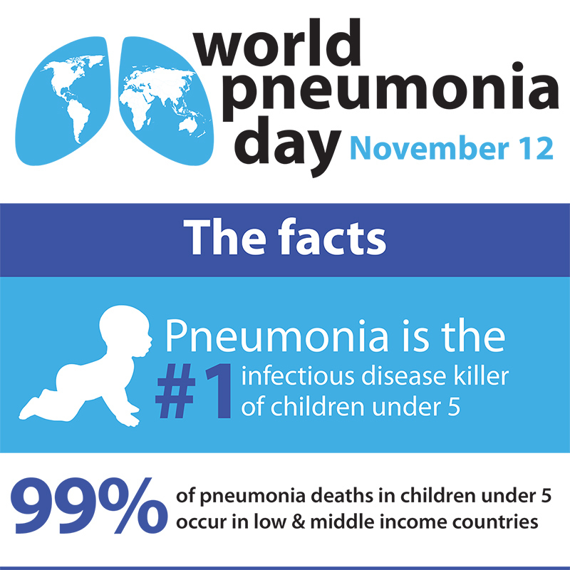

Scans can be ambiguous and difficult to interpret, presenting another source of error. According to a study in the Journal of the American Academy of Pediatrics, of 156 children with clinically diagnosed pneumonia, just 78% had positive CXRs, while 22% had negative CXRs. ([source](https://pediatrics.aappublications.org/content/142/3/e20180236)). This postive identification rate is known in the medical community as "sensitivity" and in the data science community as "recall." We are using recall as our primary metric for success because we want to avoid labeling unhealthy patients as healthy.

This presents a good use case for machine learning image classification models. By training a model to identify CXRs that present positive for pneumonia, we can provide a consistent and powerful tool for medical professionals to use as part of their diagnostic toolkit.

## Data Understanding

Our dataset consists of 5,863 pediatric chest radiographs (X-ray images) from the Guangzhou Women and Children's Medical Center, via [Kaggle](https://www.kaggle.com/paultimothymooney/chest-xray-pneumonia). All patients were 1-5 years old and the chest x-rays were taken in the course of routine care.

The original `val` folder from Kaggle contained only 16 images total, 8 from each class, which is not a sufficient size for validation. We chose to move all `val` images into the `train` folder. We will then use the `val_split` parameter in `flow_from_directory` to instantiate a validation set.

The following file structure provides the ground truth labeling needed to train the models. If you wish to run our code, you will need to reorganize the Kaggle dataset in the same way:
```
└── chest_xray
    ├── train
    │    ├──NORMAL
    │    └──PNEUMONIA
    └── test
         ├──NORMAL
         └──PNEUMONIA
```

Pneumonia in the lungs presents differently depending on its source (bacterial or viral infection), but both present as a cloudiness or occlusion on the X-ray image. Bacterial pneumonia tends to consolidate locally in one area, or lobe, of the lungs, while viral pneumonia tends to be more diffuse. 

One limitation of this dataset is that all the X-ray images are from children. It's possible that our model results are not generalizable to adult cases of pneumonia.

There is a clear over-representation of target class images in the data, which presents an issue for modeling, even though we do want to emphasize correct prediction of the target class over general accuracy. We will experiment with adding in parameters to account for this, such as `class_weight`, as the current distribution is about 3:1 in favor of the target class (23% Normal, 77% Pneumonia).

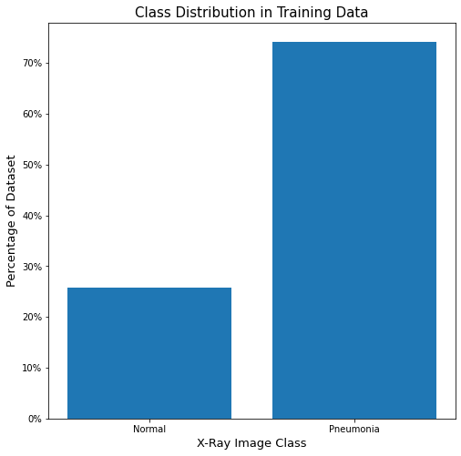


<p align="center">
  
</p>

All images are single-channel (black and white, not RGB) and almost all have an 'R' to designate the right-hand side lung. Typically, pneumonia lungs look "cloudy" or "fuzzy" compared to Normal.

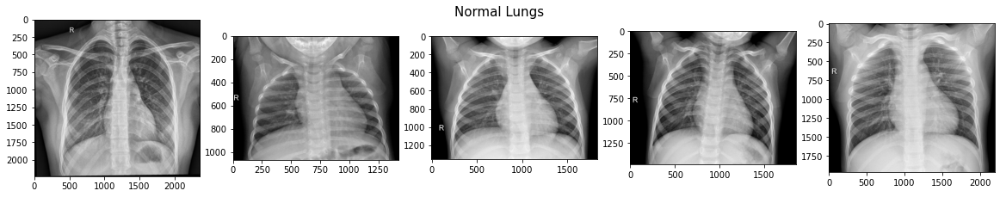

From Kaggle:
> The normal chest X-ray depicts clear lungs without any areas of abnormal opacification in the image. Bacterial pneumonia typically exhibits a focal lobar consolidation \[...] whereas viral pneumonia manifests with a more diffuse ‘‘interstitial’’ pattern in both lungs.

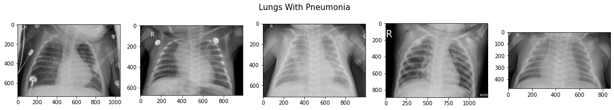

Essentially, this means that bacterial pneumonia typically gathers in one area of the lungs, while viral penumonia is more spread out.

## Modeling with neural networks

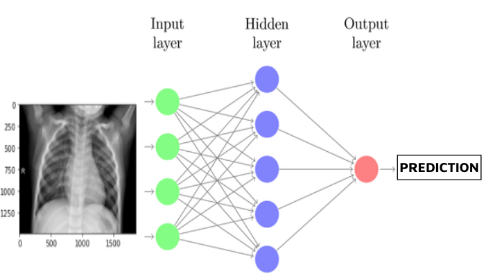

Our first simple model consists of a basic fully connected dense neural network with only 1 hidden layer, plus an output layer. 
This model serves mainly as a proof of concept and provides baseline accuracy and recall scores.

To improve on our first simple model, we iterated over several more models. The following model represents several collective improvements over these iterations, such as:
 - Using the full dataset
 - Resize to 256x256 in order to balance information retention and computational need
 - Adding more Dense layers to improve the power of the network
 - Using L2 regularization to avoid overfitting
 - Using Adam optimizer function and specify learning rate to control stability during training
 - Adding class weights to account for imbalanced classes distribution

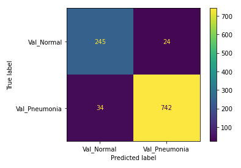

Our changes to the model both reduced overfitting and increased performance on recall and general accuracy, bringing accuracy up to 94.5% and recall to 95.6%.

Despite iterative improvements, our models using only fully connected Dense layers hit a ceiling around 95% for accuracy and recall on the validation set. We decided to add convolutional layers in order to continue improving the model. The hope is that the model will identify more granular patterns in the data by using convolutional layers with filters and pooling layers.

Our first CNN model improved on both accuracy and recall on the validation set. However, it is still leaving more false-negatives than we would want and as we continue to iterate we will focus on bringing up recall, even at the cost of accuracy. False positives have potentially fewer serious consequences (continued observation, more testing) than false negatives (untreated disease and fatality), especially with pediatric patients.

We continued to iterate with CNN models, adjusting various layers and parameters, including:
 - Introducing `BatchNormalization` layers, which reduce the range of input values to speed training and improve performance
 - Adding L2 regularization to avoid overfitting
 - Adjusting number of layers to change the complexity of the model
 - Reducing number of epochs to potentially avoid overfitting
 - Increasing kernel (filter) size from (3, 3) to (5, 5)
 
Collectively, we iterated on over a dozen models, adjusting these parameters among others. Our final model has the following architecture:

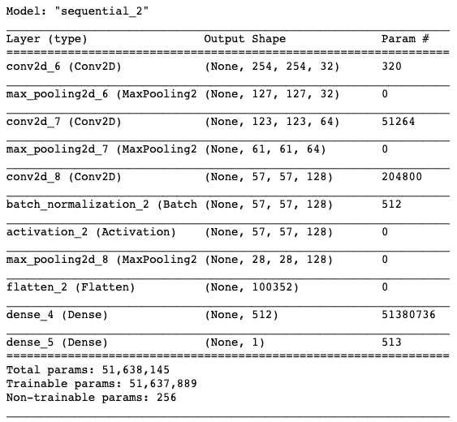

Below is a diagram of our final model, showing the architecture of the layers, as well as images surfaced from the intermediate layers. This shows that our model is attending to features located within the lungs on the x-ray images.

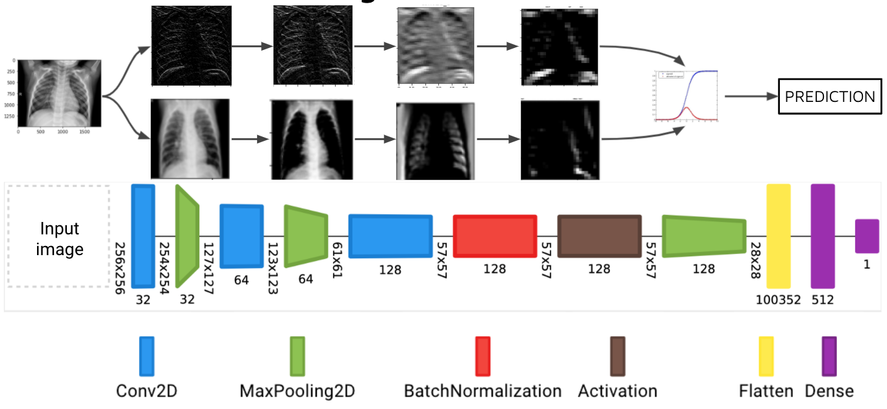

This diagram was created with [Net2Vis](https://github.com/viscom-ulm/Net2Vis) -- A Visual Grammar for Automatically Generating Publication-Tailored CNN Architecture Visualizations (Alex Bäuerle, Christian van Onzenoodt, and Timo Ropinski at Cornell University)


## Final Evaluation

Our model performed very well by our primary metric (recall), but has a lower accuracy on the testing set than on the validation set. The number of false positives is higher than we expected or would want, so futher iterations of the model would focus on lowering that number. It may even be possible to train another model specifically on misclassified images. The following shows the confusion matrix results after evaluating on our holdout (test) dataset.

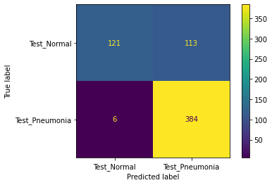

On unseen testing data, our best best model had 98.46% recall and 80.93% accuracy. Out of 624 images in the test set, the model predicted 6 false negatives and 112 false positive, with 506 correct predictions. We suspect that the low accuracy score is due to imbalance in the dataset. Chest X-rays of patients with pneumonia made up 62.5% of the test set, while chest X-rays of healthy patients made up 37.5% of the test set. 


## Exploring the model

### Misclassified Images (false positives and negatives)

In an effort to uncover the reason behind the high false positive rate, we identify and visualize the images that the model misclassified. Perhaps we can see if any patterns can be identified that may represent obvious errors in the model.

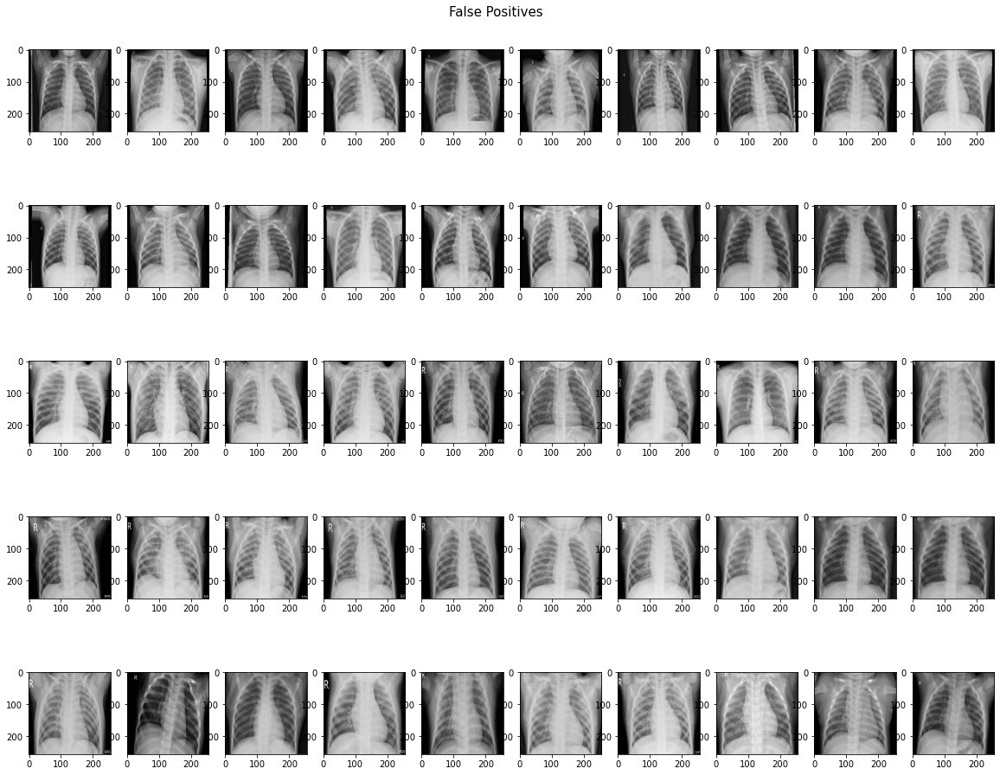

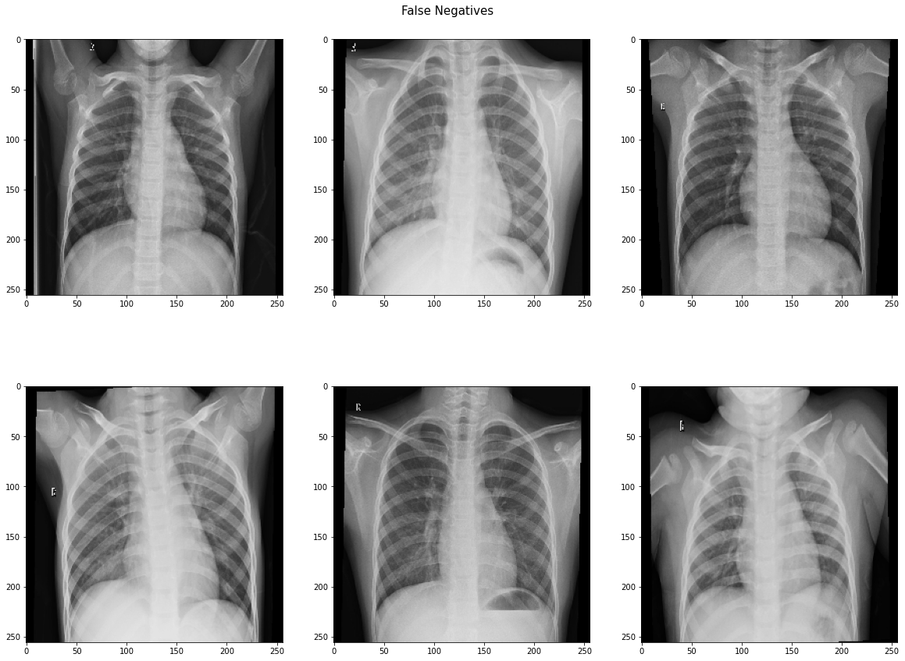

We lack the domain knowledge expertise to identify or interpret patterns in the misclassified images, although there don't seem to be any obvious patterns. Ideally, we would partner with medical professionals to see what patterns may exist that are being caught and misclassified by the model. It is notable that 5 out of the 6 false negatives were identified as showing bacterial pneumonia, which is supposed to be easier to diagnose or identify on a scan than viral pneumonia. This suggests that our model is just being over-sensitive to patterns associated with pneumonia, or is overfit to the training dataset.

### Visualizing Intermediate Layers

In order to confirm the model is analyzing truly important data (i.e., the lungs in the CXR and not other unimportant or irrelevant factors, such as the 'R' on the image), we visualize the intermediate layers of the model. This allows us to peer into the "black box" that is the CNN model, revealing the patterns in the images that each filter is attending to.

The following image shows the first activation layer--in other words, the first `Conv2D` convolutional layer in our final model--when the above image is fed into the model.

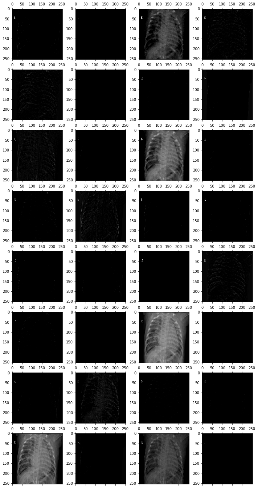

Now, rather than examining all channels from one layer, let's look at one channel from *each* layer. Note the name above each image to identify which layer of the model it comes from.

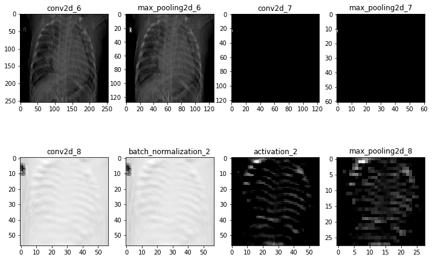

A second iteration of these visualizations with another image from the dataset can be found in the notebook. It does not appear from this albiet brief exploration that the model is obviously focusing on any particular irrelevant detail. However, further exploration could uncover systemic errors or other issues in the model. Ideally, we would partner with medical professionals who could help us better assess what features or patterns the model is likely identifying in the normal and target pneumonia class images.

## Conclusions

### Recommendations

We recommend that this model is used as part of a medical professional's diagnostic toolkit, in conjunction with a clinical assessment. We suggest that this model is used to reduce the rate of false negatives among those patients the model predicts have pneumonia. The model would likely save time as it can make diagnoses at scale very quickly.

We also recommend consulting with a medical professional, who has experience diagnosing a patient with pneumonia by looking at chest X-rays, about false positive and false negative images to determine patterns they look for, and ultimately what the model is missing.

Finally, we recommend that this model be used to increase the speed at which medical professionals determine the results of chest X-rays.

### Possible Next Steps

 - Creating a neural network capable of multiclass classification to predict three targets in the dataset, healthy patients, patients with bacterial pneumonia, and patients with viral pneumonia. 

 - Cropping images of chest X-rays, or using data augmentation, to include only data within the rib cage, limiting the interference from extremities as much as possible while training the model.

 - Seeking to idenitfy patterns in misclassified images to improve overall accuracy, especially in conjunction with medical professionals. 

 - Finally, we would create another neural network to classify chest X-rays of pateints with covid-19 or pneumonia.


## For More Information

See the full analysis in the [Jupyter Notebook](./identifying_pneumonia_cxr.ipynb) or review this [presentation](./identifying_pneumonia_cxr_presentation.pdf)

### Structure of Repository:

```
├── Code (working notebooks)
├── chest_xray (dataset)
├── Images (for readme, presentation)
├── models (saved .h5 files of trained models)
├── net2vis (model diagram files)
├── identifying_pneumonia_cxr.ipynb
├── identifying_pneumonia_cxr_presentation.pdf
├── project_functions.py
└── README.md
```
